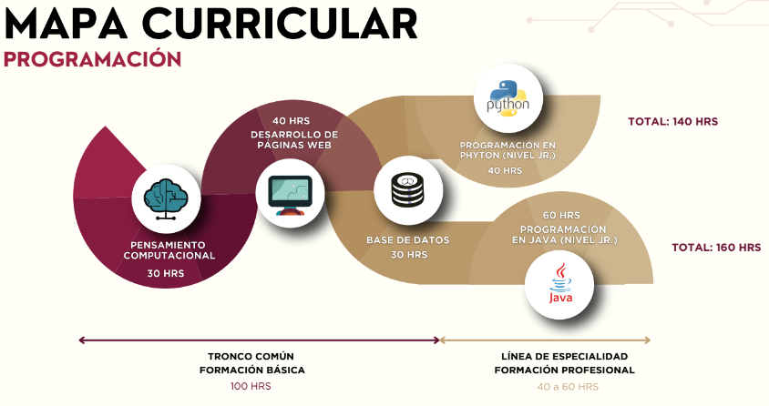
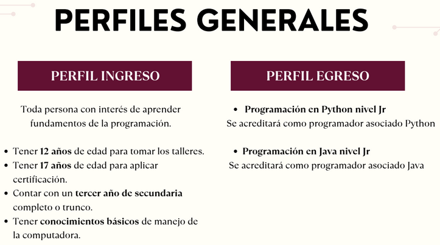
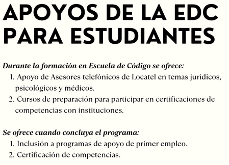

# ESCUELA DE CÓDIGO

## OBJETIVO

Que el estudiante aplique las habilidades, conocimientos y destrezas adquiridas en la resolución de problemáticas tecnológicas en desarrollo y programación, con el propósito de poder integrarse a un campo laboral competente, como puede ser en los sistemas automatizados de instituciones públicas o privadas y que les permita mejorar su calidad de vida y la de su comunidad.

### [Moodle](https://educacion.pilares.cdmx.gob.mx/)

#### [Taller de pensamiento computacional](https://github.com/angelumoca21/PensamientoComputacional)
#### [Taller de desarrollo de páginas web](https://github.com/angelumoca21/DesarrolloDePaginasWeb)
#### [Taller de base de datos]()
#### [Taller de programación Python o Java]()